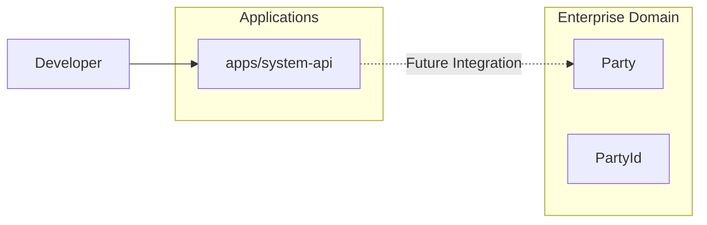
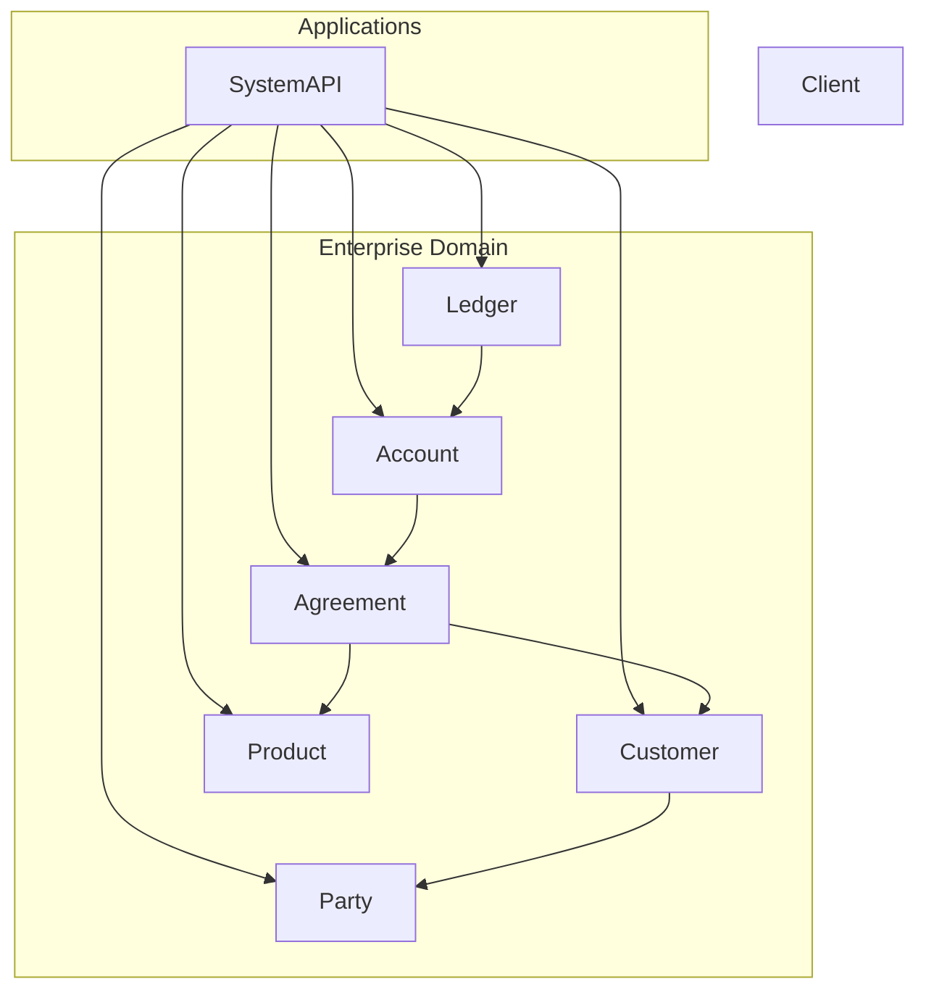

# EPOS Software Architecture

## Purpose

This document provides the architectural evolution of the EPOS platform.

It is maintained throughout the life of the program and illustrates:

- The current production architecture
- The target architecture for the current release
- The long-term target architecture
- Architectural principles adopted
- Architectural patterns introduced
- Key architecture decisions and tradeoffs

---

# Current State Architecture

**Status:** Release 1 – Phase 1

The current implementation provides the engineering foundation and the first enterprise domain package.



### Current Capabilities

- Monorepo (pnpm workspaces)
- System API
- Health endpoints
- Readiness endpoints
- Enterprise Domain package
- Party entity
- PartyId value object
- Build pipeline
- ADR governance
- Program governance

---

# Interim Architecture (After Release 1)

The objective of Release 1 is to establish the enterprise foundation that every future banking capability will build upon.



### Release 1 Deliverables

Enterprise Foundation

- Party
- Customer
- Product
- Agreement
- Account
- Ledger

Engineering Foundation

- Domain-driven architecture
- Clean Architecture
- Repository interfaces
- Factory methods
- Domain events
- Value objects
- Shared Kernel (introduced through refactoring)

Infrastructure

- System API
- Docker
- CI/CD
- Engineering standards
- ADRs

---

# Future State Architecture (Target Release 7)

```mermaid
flowchart TB

Channels

subgraph Enterprise Services

Notifications
Documents
Reporting
Workflow
Audit

end

subgraph Enterprise Banking

Party
Customer
Products
Accounts
Ledger

Payments
Cards
FX
Trade

Risk
Compliance

end

subgraph Platform

EventPlatform["Event Platform (Kafka)"]
WorkflowEngine
Observability
Configuration

end

subgraph Infrastructure

PostgreSQL

Redis

Kubernetes

ServiceMesh

end

subgraph Intelligence

AI["Enterprise AI Copilot"]

end

Channels --> Enterprise Banking

Enterprise Banking --> Platform

Platform --> Infrastructure

Infrastructure --> AI

Enterprise Banking --> Enterprise Services

```

### Target Capabilities

Enterprise Banking

- Customer Management
- Products
- Accounts
- Ledger
- Payments
- Cards
- Foreign Exchange
- Trade Finance

Enterprise Services

- Notifications
- Documents
- Reporting
- Workflow
- Audit

Platform

- Event Streaming
- Distributed Messaging
- Configuration
- Observability

Infrastructure

- Kubernetes
- PostgreSQL
- Redis
- Service Mesh

Enterprise Intelligence

- AI Copilot
- Operational Intelligence
- Enterprise Analytics

---

# Architecture Evolution

| Release | Architecture Evolution |
|----------|------------------------|
| **1.0** | Enterprise Domain Foundation |
| **2.0** | Core Platform Services |
| **3.0** | Core Banking Services |
| **4.0** | Enterprise Banking Capabilities |
| **5.0** | Distributed Platform |
| **6.0** | Platform Engineering & Reliability |
| **7.0** | Enterprise Intelligence & Unified Operations |

---

# Architecture Principles

- Domain-Driven Design
- Business-first modelling
- Clean Architecture
- Infrastructure independence
- Separation of concerns
- API-first integration
- Modular monorepo
- Incremental architecture evolution
- Contract-first design
- Single source of truth

---

# Architecture Patterns

| Pattern | First Introduced | Status |
|----------|------------------|--------|
| Entity | Release 1 | ✅ |
| Value Object | Release 1 | ✅ |
| Factory Method | Release 1 | Planned |
| Repository Pattern | Release 1 | Planned |
| Domain Events | Release 1 | Planned |
| Aggregate Root | Release 1 | Planned |
| Shared Kernel | Release 1 | Planned |
| Transaction Boundary | Release 4 | Planned |
| Unit of Work | Release 4 | Planned |
| Idempotency | Release 4 | Planned |
| Outbox Pattern | Release 4 | Planned |
| Event Streaming | Release 5 | Planned |
| Saga Pattern | Release 5 | Planned |
| Retry Pattern | Release 5 | Planned |
| Dead Letter Queue | Release 5 | Planned |
| CQRS | Release 5 | Planned |
| Event Sourcing | Release 5 | Planned |
| Circuit Breaker | Release 6 | Planned |
| Bulkhead | Release 6 | Planned |
| Service Mesh | Release 6 | Planned |
| AI Copilot | Release 7 | Planned |

---

# Architecture Tradeoffs

| Decision | Benefit | Tradeoff |
|----------|---------|----------|
| Monorepo | Simplified dependency management | Larger repository |
| Business-first modelling | Stable enterprise model | Slower initial development |
| Domain-first implementation | Independent business logic | More upfront design |
| Shared Kernel introduced through refactoring | Simpler learning path | Later abstraction |
| API-first integration | Loose coupling | Additional interface management |
| Event-driven architecture | Scalability and resilience | Eventual consistency |
| Outbox Pattern | Reliable event publication | Additional infrastructure components |
| Repository Pattern | Database independence | Extra abstraction layer |

---

# Revision History

| Version | Release | Description |
|----------|---------|-------------|
| 1.0 | Release 1 | Initial enterprise architecture baseline |